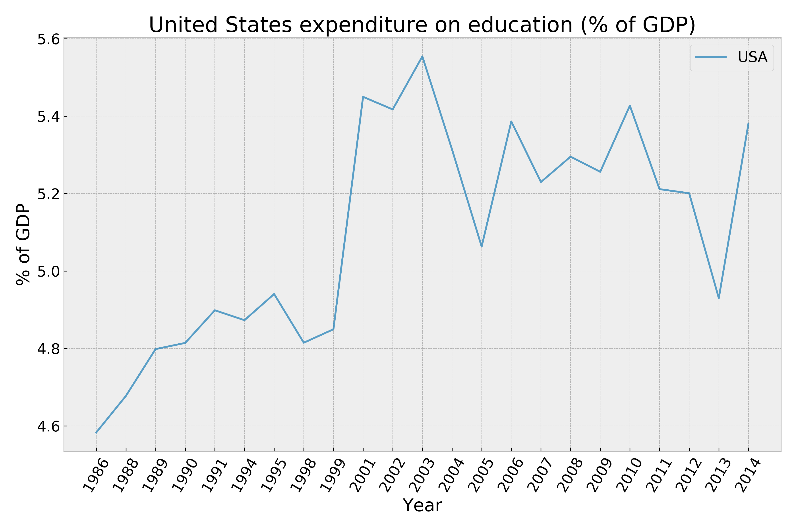
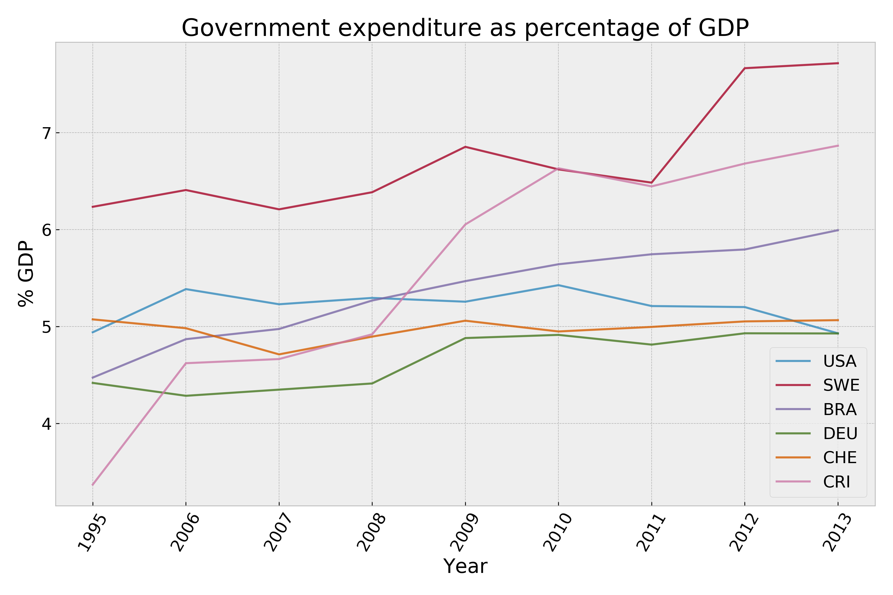
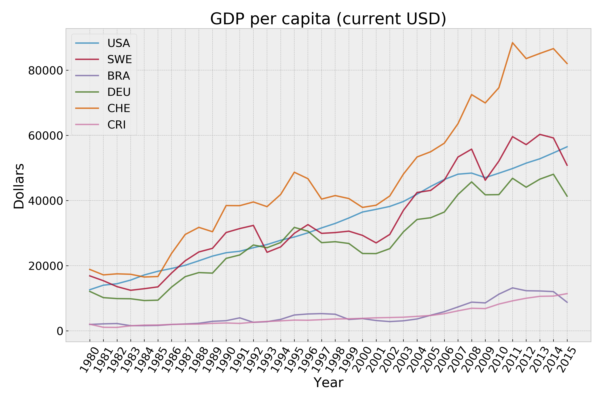
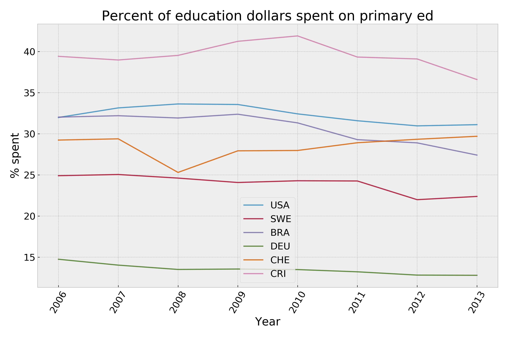
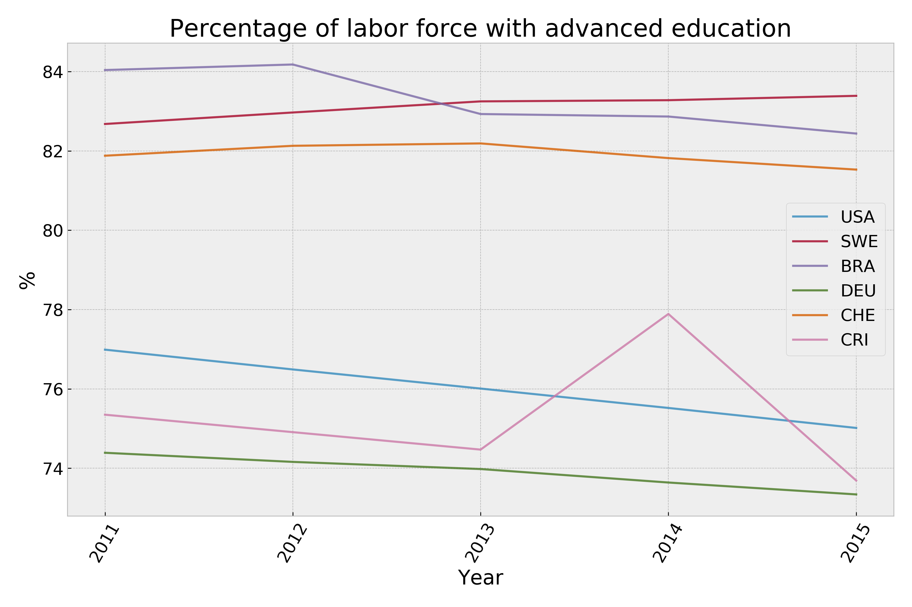
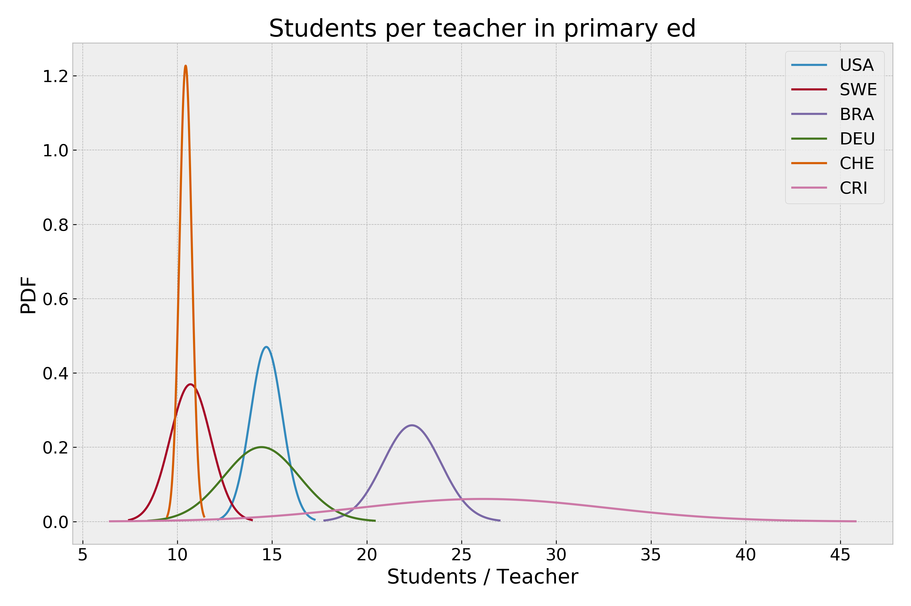
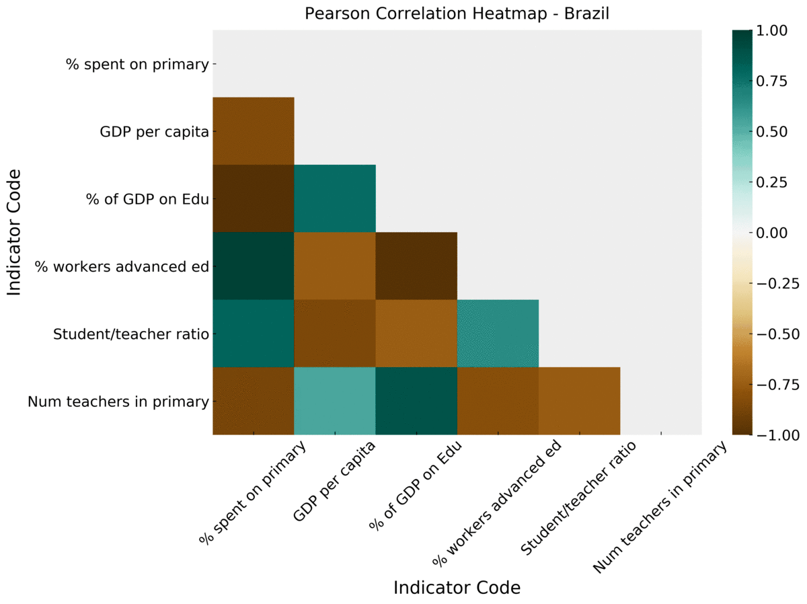
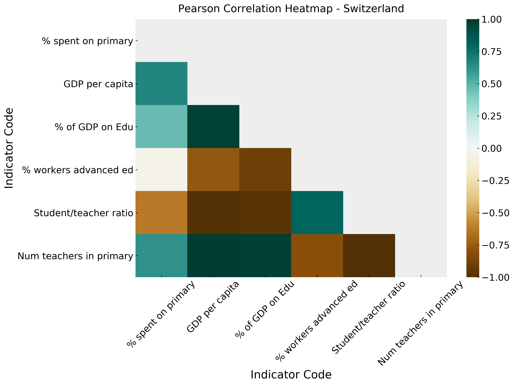
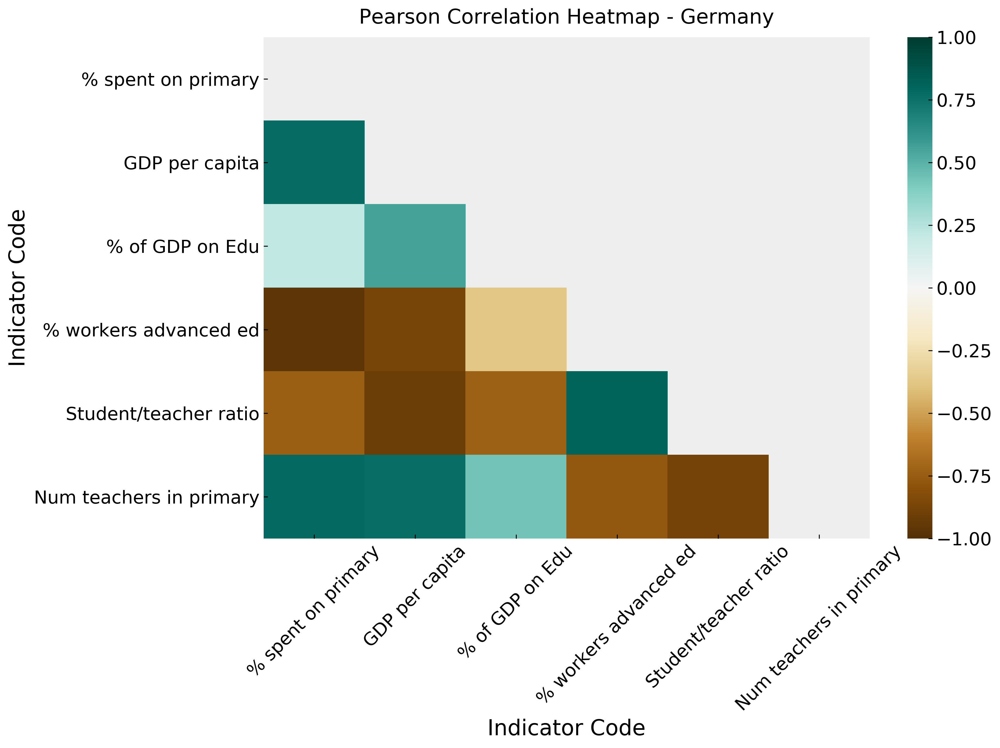
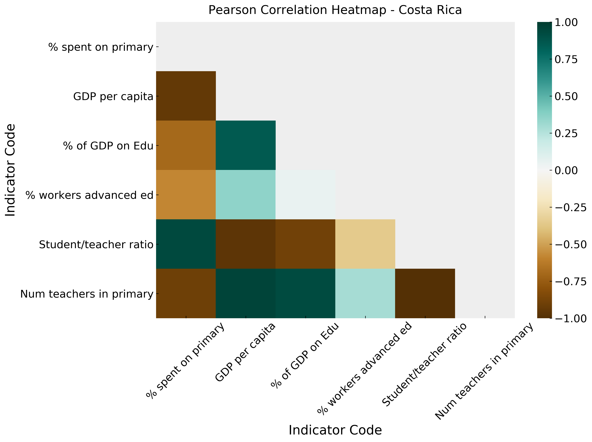

# Education Spending & Outcomes Comparison

## Introduction
I have a son who just finished up first grade. The last two months of his school year took place through a remote-learning platform, and the continuing COVID-19 pandemic could result in much if not all of his second grade education happening through the same platform. I've been thinking a lot about our education system since he's become school-aged, as well as my own education and the effectiveness and utility of the education system in the US. The book _Outliers_ by Malcolm Gladwell also has some interesting thoughts on education that added to my interest on the subject. There are huge differences state-to-state within the US, which are illustrated when my wife and I talk about our own education experiences (New York and Nevada respectively) and the in-process education of our son.

Every nation has their own theory of how to educate its children and in turn, different outcomes within the population. Some of those outcomes are easily quantifiable and easily correlated to education funding. Many other outcomes are less concrete.

I chose to focus on primary education for this study. In American terms that roughly corresponds to 1st through 6th grade.

## Questions

### **How does the relationship between education spending correlate to different outcomes?**

### **Does the amount of education the workforce has correlate with the GDP per capita for each country?**

Each of these questions would be unique to the country, and the correlation values could be compared between countries.

## Data Cleanup
I downloaded the data from Kaggle, and it was well-organized and garbage character free. I compared this to the data available at The World Bank's data portal, and it was formatted in the same way. However, the dataset on Kaggle was much larger than any single dataset I could download off The World Bank site at one time. The data ends in 2015 but is very inconsistent that year, so most of the plots end in 2014. Unfortunately the inconsistent nature of a lot of the data collection resulted in some narrow windows where each country had data for common indicators. 

Data cleaning was performed using Pandas to remove the _many_ blank rows in the dataset, reducing the dataset down from >326MB to 95MB; over 530,000 blank rows were removed as the first step in the cleaning pipeline. There were also many years that had no data at all (including years for projections from 2020 - 2100). The output from that step was then filtered to leave only data from the countries and indicator codes that were decided on before the cleaning started. That resulted in a single aggregated 17.3kB file and twelve 3kB files that all the subsequent analysis was performed from.

The countries and the indicator codes that were used to filter the data are stored in two .csv files to provide a fast way to change the filter parameters.

#### A brief look at the raw data
|    | Country Name   | Country Code   | Indicator Name                                                          | Indicator Code   |     1970 |     1971 |     1972 |     1973 |     1974 |     1975 |   1976 |     1977 |     1978 |     1979 |     1980 |     1981 |     1982 |     1983 |     1984 |     1985 |     1986 |     1987 |     1988 |     1989 |     1990 |     1991 |     1992 |     1993 |     1994 |     1995 |     1996 |     1997 |     1998 |     1999 |     2000 |     2001 |     2002 |     2003 |     2004 |     2005 |     2006 |     2007 |     2008 |    2009 |    2010 |     2011 |     2012 |     2013 |     2014 |   2015 |   2016 |   2017 |   2020 |   2025 |   2030 |   2035 |   2040 |   2045 |   2050 |   2055 |   2060 |   2065 |   2070 |   2075 |   2080 |   2085 |   2090 |   2095 |   2100 |   Unnamed: 69 |
|---:|:---------------|:---------------|:------------------------------------------------------------------------|:-----------------|---------:|---------:|---------:|---------:|---------:|---------:|-------:|---------:|---------:|---------:|---------:|---------:|---------:|---------:|---------:|---------:|---------:|---------:|---------:|---------:|---------:|---------:|---------:|---------:|---------:|---------:|---------:|---------:|---------:|---------:|---------:|---------:|---------:|---------:|---------:|---------:|---------:|---------:|---------:|--------:|--------:|---------:|---------:|---------:|---------:|-------:|-------:|-------:|-------:|-------:|-------:|-------:|-------:|-------:|-------:|-------:|-------:|-------:|-------:|-------:|-------:|-------:|-------:|-------:|-------:|--------------:|
|  0 | Arab World     | ARB            | Adjusted net enrolment rate, lower secondary, both sexes (%)            | UIS.NERA.2       | nan      | nan      | nan      | nan      | nan      | nan      |    nan | nan      | nan      | nan      | nan      | nan      | nan      | nan      | nan      | nan      | nan      | nan      | nan      | nan      | nan      | nan      | nan      | nan      | nan      | nan      | nan      | nan      | nan      | nan      | nan      | nan      | nan      | nan      | nan      | nan      | nan      | nan      | nan      | nan     | nan     | nan      | nan      | nan      | nan      |    nan |    nan |    nan |    nan |    nan |    nan |    nan |    nan |    nan |    nan |    nan |    nan |    nan |    nan |    nan |    nan |    nan |    nan |    nan |    nan |           nan |
|  1 | Arab World     | ARB            | Adjusted net enrolment rate, lower secondary, female (%)                | UIS.NERA.2.F     | nan      | nan      | nan      | nan      | nan      | nan      |    nan | nan      | nan      | nan      | nan      | nan      | nan      | nan      | nan      | nan      | nan      | nan      | nan      | nan      | nan      | nan      | nan      | nan      | nan      | nan      | nan      | nan      | nan      | nan      | nan      | nan      | nan      | nan      | nan      | nan      | nan      | nan      | nan      | nan     | nan     | nan      | nan      | nan      | nan      |    nan |    nan |    nan |    nan |    nan |    nan |    nan |    nan |    nan |    nan |    nan |    nan |    nan |    nan |    nan |    nan |    nan |    nan |    nan |    nan |           nan |
|  2 | Arab World     | ARB            | Adjusted net enrolment rate, lower secondary, gender parity index (GPI) | UIS.NERA.2.GPI   | nan      | nan      | nan      | nan      | nan      | nan      |    nan | nan      | nan      | nan      | nan      | nan      | nan      | nan      | nan      | nan      | nan      | nan      | nan      | nan      | nan      | nan      | nan      | nan      | nan      | nan      | nan      | nan      | nan      | nan      | nan      | nan      | nan      | nan      | nan      | nan      | nan      | nan      | nan      | nan     | nan     | nan      | nan      | nan      | nan      |    nan |    nan |    nan |    nan |    nan |    nan |    nan |    nan |    nan |    nan |    nan |    nan |    nan |    nan |    nan |    nan |    nan |    nan |    nan |    nan |           nan |
|  3 | Arab World     | ARB            | Adjusted net enrolment rate, lower secondary, male (%)                  | UIS.NERA.2.M     | nan      | nan      | nan      | nan      | nan      | nan      |    nan | nan      | nan      | nan      | nan      | nan      | nan      | nan      | nan      | nan      | nan      | nan      | nan      | nan      | nan      | nan      | nan      | nan      | nan      | nan      | nan      | nan      | nan      | nan      | nan      | nan      | nan      | nan      | nan      | nan      | nan      | nan      | nan      | nan     | nan     | nan      | nan      | nan      | nan      |    nan |    nan |    nan |    nan |    nan |    nan |    nan |    nan |    nan |    nan |    nan |    nan |    nan |    nan |    nan |    nan |    nan |    nan |    nan |    nan |           nan |
|  4 | Arab World     | ARB            | Adjusted net enrolment rate, primary, both sexes (%)                    | SE.PRM.TENR      |  54.8221 |  54.8941 |  56.2094 |  57.2671 |  57.9911 |  59.3655 |     61 |  61.9227 |  62.6934 |  64.3832 |  65.6178 |  66.0852 |  66.6081 |  67.2905 |  68.5101 |  69.0332 |  69.9449 |  71.0419 |  71.6938 |  71.6991 |  71.9958 |  72.6028 |  70.0327 |  70.4648 |  72.6457 |  71.8118 |  73.9035 |  74.4252 |  75.1108 |  76.2543 |  77.2457 |  78.8005 |  80.0514 |  80.8054 |  81.6071 |  82.4895 |  82.6855 |  83.2803 |  84.0119 |  84.196 |  85.212 |  85.2451 |  86.1017 |  85.5119 |  85.3202 |    nan |    nan |    nan |    nan |    nan |   

#### A filtered single row for examination
| Country Code   | Indicator Code    |    1986 |    1988 |   1989 |    1990 |    1991 |    1994 |    1995 |    1998 |    1999 |    2001 |    2002 |    2003 |    2004 |    2005 |    2006 |    2007 |    2008 |    2009 |    2010 |   2011 |    2012 |    2013 |    2014 |
|:---------------|:------------------|--------:|--------:|-------:|--------:|--------:|--------:|--------:|--------:|--------:|--------:|--------:|--------:|--------:|--------:|--------:|--------:|--------:|--------:|--------:|-------:|--------:|--------:|--------:|
| USA            | SE.XPD.TOTL.GD.ZS | 4.58326 | 4.67762 | 4.7985 | 4.81445 | 4.89873 | 4.87318 | 4.94068 | 4.81499 | 4.84966 | 5.44979 | 5.41733 | 5.55414 | 5.31416 | 5.06331 | 5.38623 | 5.22984 | 5.29536 | 5.25622 | 5.42707 | 5.2115 | 5.20087 | 4.93013 | 5.38078 |

## Countries
I chose 6 different countries for this study. There are some diverse ideas within this group about how education is run and how it relates to the workforce, and I thought it would be intersting to illustrate some of those differences. 

The countries are:
* United States - USA
* Sweden - SWE
* Brazil - BRA
* Germany - DEU
* Switzerland - CHE
* Costa Rica - CRI

## Indicator Codes
From The World Bank:
> "World Development Indicators (WDI) is the primary World Bank collection of development indicators, compiled from officially recognized international sources. It presents the most current and accurate global development data available, and includes national, regional and global estimates."

There are more than 3,600 indicator codes per country listed within the data, and many seem to overlap in spirit. Each of the descriptions is fairly clear, and after much digging, the following codes worthy of exploration:

* Government expenditure as % of GDP - SE.XPD.TOTL.GD.ZS  
* Expenditure on primary education as % of total on education - SE.XPD.PRIM.ZS 
* Pupil-teacher ratios in primary education - SE.PRM.ENRL.TC.ZS
* Number of teachers in primary education - SE.PRM.TCHR
* Percentage of the labor force with advanced education - SL.TLF.ADVN.ZS
* GRP per capita, current dollars - NY.GDP.PCAP.CD

There are a couple of metrics that I had hoped were in the data, but weren't (or I couldn't find them). Those were the length of the school year and length of the school day. A future expansion of this project could include those as well.

## Visualization
There a lot of interesting things were highlighted by plotting the data. As it's the base metric of this project, Government Expenditure on Education as % of GDP is the first to look at. The US has been relatively consistent with its spending, while in the same time period Costa Rica has doubled its spending. Sweden is consistently high, while Germany stays toward the lower end, only a little lower than neighboring Switzerland. 

GDP per capita has rapidly diverged over the past 35 years. 

Relative spending on primary education specifically tends to stay fairly constant within a country. Germany comes in again at the bottom of the heap.

Now let's take a look at one of the outcomes of education systems - the percentage of the labor force with advanced educations. Advanced education is defined as any amount of post-secondary education, including vocational programs (like this one!), college, and university. Some surprises here are the high percentage mean and tight distribution of the Brazilian workforce, while the US has a simliar mean but much larger deviation. Something that wasn't surprising is the low percentage of highly educated Germans because of their strong culture of apprenticeships over university in many fields.

Also to note: the downward trend in many of the countries (albeit over a short period).

## Basic Analysis

I chose to use visual analysis techniques initially to see how the numbers for each metric were distributed relative to one another. The PDFs show another interesting 

Right away, this plot of the PDFs of the amount of students per teacher jumps out as something that could likely be highly correlated to the total investment in education a country makes. Let's remember this metric.

## Indicator Code Correlation

The correlation heatmaps generated for each country tell an interesting story. In these heatmaps, darker colors represent higher correlation values. One of the common elements across the board is how highly the students per teacher number is correlated to education funding, which seems to be an easy.

Switzerland shows some pretty deep colors, which seem to follow its pattern of highly funding its education system.

Compared to its neighbor Switzerland, Germany has lower correlation values for many of the indicators. 

## Conclusion

It seems to be easy to correlate things that are directly related to education, such as students per teacher in classrooms and the overall number of teachers in primary education. It seems those can be thought of as direct results of the amount a government invests in its education system.

Where things get a little trickier is the amount of people in the workforce that have advanced educations. They seem to be correlated in countries that value higher education, such as the United States. It also seems to trend the other way in Germany, where work experience is valued to a much higher degree than degrees. I'm not familiar with the societal value of higher education in the other countries, so the correlations there could be down to a number of other factors.

GDP per capita also comes in high in the correlation values category, but I think that is too complicated a number to associate with anything other than perhaps the amount of workers with advanced educations.

This was an interesting evaluation for me, and I'm looking forward to expanding more of the capabilities of my scripts!

## Points to Expand Project Further

* Add function to pick highest correlation values from each set of indicators to run further studies on
* Add bootstrapping to the correlation results to get more confident results
* Add R2 element to bootstrap, and create PDF of its distribution
* Get more up-to-date data
* Nearly everything is parametric now, and can produce different results. Just need to implement parametric chart labels and filenames.
* Expand Indicator Codes list
* Run tests on collected regions that are present in the data
* Integrate other data, such as length of school year, median incomes, etc