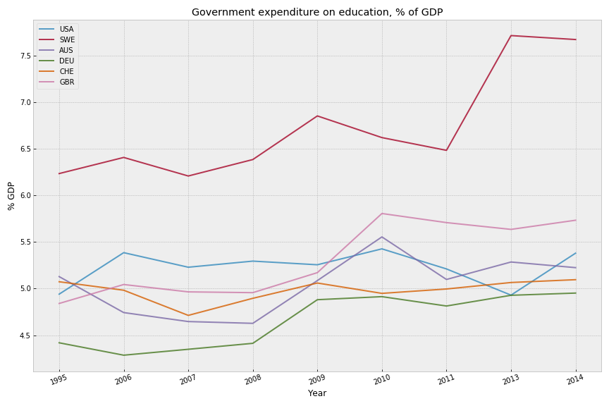

# Education Spending & Outcomes Comparison

## Introduction
I have a son who just finished up first grade with the last two months of his school year happening through a remote-learning platform. COVID-19 will likely result in much if not all of his second grade education happening through the same platform. I've been thinking a lot about our education system since he's become school-aged, but also my own education and the effectiveness and utility of the education system in the US. There are huge differences state-to-state as well as internationally. 

Note: data in Europe will change due to many countries switching to the Euro in 2002.

## Methodology
Data cleaning was performed using Pandas to remove the many NaN values in the dataset, reducing the dataset down from >326MB to 95MB. There were numerous indicator codes that had no records, and there were many years that had no data at all (including years for projections from 2020 - 2100).

## Parameters
The following Indicator Codes were interesting to me:

   Government expenditure as % of GDP - SE.XPD.TOTL.GD.ZS  
   Expenditure on primary education as % of total on education - SE.XPD.PRIM.ZS  

## Visualization
Below is a chart showing the selected countries and their respective spending on education as a % of GDP.
