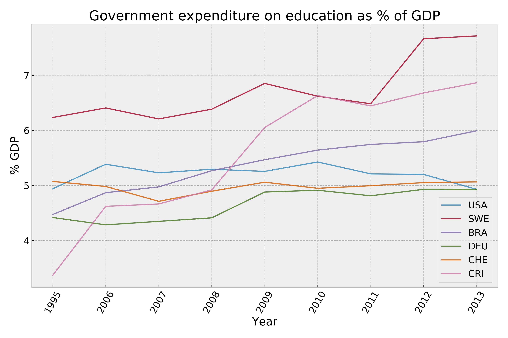
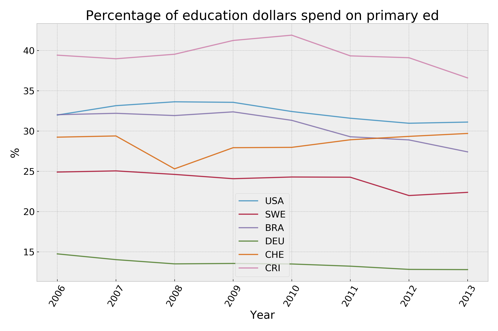

# Education Spending & Outcomes Comparison

## Introduction
I have a son who just finished up first grade. The last two months of his school year took place through a remote-learning platform, and the continuing COVID-19 pandemic could result in much if not all of his second grade education happening through the same platform. I've been thinking a lot about our education system since he's become school-aged, as well as my own education and the effectiveness and utility of the education system in the US. There are huge differences state-to-state within the US, which are illustrated when my wife and I talk about our own education experiences (New York and Nevada respectively) and the in-process education of our son.

Every nation has their own theory of how to educate its children and in turn, different outcomes within the population. Some of those outcomes are easily quantifiable and easily correlated to education funding. Many other outcomes are less concrete.

I chose to focus on primary education for this study. In American terms that roughly corresponds to 1st through 6th grade.

With this dataset, I jumped in to explore some of these ideas.

## Questions

**How does the relationship between education spending correlate to different outcomes?**\

**Does the amount of education the workforce has correlate with the GDP per capita for each country?**\

Knowing a little bit about 

#### How much the US spends on education

## Data Cleanup
I downloaded the data from Kaggle, and it was well-organized and junk-free. I compared this to the data available at The World Bank's data portal, and it was formatted in the same way. However, the dataset on Kaggle was much larger than any I could download off The World Bank site at a time. The data ends in 2015 but is very inconsistent that year, so most of the plots end in 2014.

Data cleaning was performed using Pandas to remove the _many_ blank rows in the dataset, reducing the dataset down from >326MB to 95MB; over 530,000 blank rows were removed as the first step in the cleaning pipeline. There were also many years that had no data at all (including years for projections from 2020 - 2100). The output from that step was then filtered to leave only data from the countries and indicator codes that were decided on before the cleaning started. That resulted in a single aggregated 17.3kB file and twelve 3kB files that all the subsequent analysis was performed from.

The countries and the indicator codes that were used to filter the data are stored in two .csv files to provide a fast way to change the filter parameters.

#### A brief look at the raw data
|    | Country Name   | Country Code   | Indicator Name                                                          | Indicator Code   |     1970 |     1971 |     1972 |     1973 |     1974 |     1975 |   1976 |     1977 |     1978 |     1979 |     1980 |     1981 |     1982 |     1983 |     1984 |     1985 |     1986 |     1987 |     1988 |     1989 |     1990 |     1991 |     1992 |     1993 |     1994 |     1995 |     1996 |     1997 |     1998 |     1999 |     2000 |     2001 |     2002 |     2003 |     2004 |     2005 |     2006 |     2007 |     2008 |    2009 |    2010 |     2011 |     2012 |     2013 |     2014 |   2015 |   2016 |   2017 |   2020 |   2025 |   2030 |   2035 |   2040 |   2045 |   2050 |   2055 |   2060 |   2065 |   2070 |   2075 |   2080 |   2085 |   2090 |   2095 |   2100 |   Unnamed: 69 |
|---:|:---------------|:---------------|:------------------------------------------------------------------------|:-----------------|---------:|---------:|---------:|---------:|---------:|---------:|-------:|---------:|---------:|---------:|---------:|---------:|---------:|---------:|---------:|---------:|---------:|---------:|---------:|---------:|---------:|---------:|---------:|---------:|---------:|---------:|---------:|---------:|---------:|---------:|---------:|---------:|---------:|---------:|---------:|---------:|---------:|---------:|---------:|--------:|--------:|---------:|---------:|---------:|---------:|-------:|-------:|-------:|-------:|-------:|-------:|-------:|-------:|-------:|-------:|-------:|-------:|-------:|-------:|-------:|-------:|-------:|-------:|-------:|-------:|--------------:|
|  0 | Arab World     | ARB            | Adjusted net enrolment rate, lower secondary, both sexes (%)            | UIS.NERA.2       | nan      | nan      | nan      | nan      | nan      | nan      |    nan | nan      | nan      | nan      | nan      | nan      | nan      | nan      | nan      | nan      | nan      | nan      | nan      | nan      | nan      | nan      | nan      | nan      | nan      | nan      | nan      | nan      | nan      | nan      | nan      | nan      | nan      | nan      | nan      | nan      | nan      | nan      | nan      | nan     | nan     | nan      | nan      | nan      | nan      |    nan |    nan |    nan |    nan |    nan |    nan |    nan |    nan |    nan |    nan |    nan |    nan |    nan |    nan |    nan |    nan |    nan |    nan |    nan |    nan |           nan |
|  1 | Arab World     | ARB            | Adjusted net enrolment rate, lower secondary, female (%)                | UIS.NERA.2.F     | nan      | nan      | nan      | nan      | nan      | nan      |    nan | nan      | nan      | nan      | nan      | nan      | nan      | nan      | nan      | nan      | nan      | nan      | nan      | nan      | nan      | nan      | nan      | nan      | nan      | nan      | nan      | nan      | nan      | nan      | nan      | nan      | nan      | nan      | nan      | nan      | nan      | nan      | nan      | nan     | nan     | nan      | nan      | nan      | nan      |    nan |    nan |    nan |    nan |    nan |    nan |    nan |    nan |    nan |    nan |    nan |    nan |    nan |    nan |    nan |    nan |    nan |    nan |    nan |    nan |           nan |
|  2 | Arab World     | ARB            | Adjusted net enrolment rate, lower secondary, gender parity index (GPI) | UIS.NERA.2.GPI   | nan      | nan      | nan      | nan      | nan      | nan      |    nan | nan      | nan      | nan      | nan      | nan      | nan      | nan      | nan      | nan      | nan      | nan      | nan      | nan      | nan      | nan      | nan      | nan      | nan      | nan      | nan      | nan      | nan      | nan      | nan      | nan      | nan      | nan      | nan      | nan      | nan      | nan      | nan      | nan     | nan     | nan      | nan      | nan      | nan      |    nan |    nan |    nan |    nan |    nan |    nan |    nan |    nan |    nan |    nan |    nan |    nan |    nan |    nan |    nan |    nan |    nan |    nan |    nan |    nan |           nan |
|  3 | Arab World     | ARB            | Adjusted net enrolment rate, lower secondary, male (%)                  | UIS.NERA.2.M     | nan      | nan      | nan      | nan      | nan      | nan      |    nan | nan      | nan      | nan      | nan      | nan      | nan      | nan      | nan      | nan      | nan      | nan      | nan      | nan      | nan      | nan      | nan      | nan      | nan      | nan      | nan      | nan      | nan      | nan      | nan      | nan      | nan      | nan      | nan      | nan      | nan      | nan      | nan      | nan     | nan     | nan      | nan      | nan      | nan      |    nan |    nan |    nan |    nan |    nan |    nan |    nan |    nan |    nan |    nan |    nan |    nan |    nan |    nan |    nan |    nan |    nan |    nan |    nan |    nan |           nan |
|  4 | Arab World     | ARB            | Adjusted net enrolment rate, primary, both sexes (%)                    | SE.PRM.TENR      |  54.8221 |  54.8941 |  56.2094 |  57.2671 |  57.9911 |  59.3655 |     61 |  61.9227 |  62.6934 |  64.3832 |  65.6178 |  66.0852 |  66.6081 |  67.2905 |  68.5101 |  69.0332 |  69.9449 |  71.0419 |  71.6938 |  71.6991 |  71.9958 |  72.6028 |  70.0327 |  70.4648 |  72.6457 |  71.8118 |  73.9035 |  74.4252 |  75.1108 |  76.2543 |  77.2457 |  78.8005 |  80.0514 |  80.8054 |  81.6071 |  82.4895 |  82.6855 |  83.2803 |  84.0119 |  84.196 |  85.212 |  85.2451 |  86.1017 |  85.5119 |  85.3202 |    nan |    nan |    nan |    nan |    nan |   

#### A filtered single row for examination
| Country Code   | Indicator Code    |    1986 |    1988 |   1989 |    1990 |    1991 |    1994 |    1995 |    1998 |    1999 |    2001 |    2002 |    2003 |    2004 |    2005 |    2006 |    2007 |    2008 |    2009 |    2010 |   2011 |    2012 |    2013 |    2014 |
|:---------------|:------------------|--------:|--------:|-------:|--------:|--------:|--------:|--------:|--------:|--------:|--------:|--------:|--------:|--------:|--------:|--------:|--------:|--------:|--------:|--------:|-------:|--------:|--------:|--------:|
| USA            | SE.XPD.TOTL.GD.ZS | 4.58326 | 4.67762 | 4.7985 | 4.81445 | 4.89873 | 4.87318 | 4.94068 | 4.81499 | 4.84966 | 5.44979 | 5.41733 | 5.55414 | 5.31416 | 5.06331 | 5.38623 | 5.22984 | 5.29536 | 5.25622 | 5.42707 | 5.2115 | 5.20087 | 4.93013 | 5.38078 |

## Countries
I chose 6 different countries for this study. There are some diverse ideas within this set about how education is run and how it relates to the workforce, and I thought it would be intersting to illustrate some of those differences. 

The countries are:
* United States
* Sweden
* Brazil
* Germany
* Switzerland
* Costa Rica

## Indicator Codes
From The World Bank:
> "World Development Indicators (WDI) is the primary World Bank collection of development indicators, compiled from officially recognized international sources. It presents the most current and accurate global development data available, and includes national, regional and global estimates."

There are more than 3,600 indicator codes per country listed within the data, and many seem to overlap in spirit. Each of the descriptions is fairly clear, and after much digging, the following codes worthy of exploration:

* Government expenditure as % of GDP - SE.XPD.TOTL.GD.ZS  
* Expenditure on primary education as % of total on education - SE.XPD.PRIM.ZS 
* Pupil-teacher ratios in primary education - SE.PRM.ENRL.TC.ZS
* Number of teachers in primary education - SE.PRM.TCHR
* Percentage of the labor force with advanced education - SL.TLF.ADVN.ZS
* GRP per capita, current dollars - NY.GDP.PCAP.CD

There are a couple of metrics that I had hoped were in the data, but weren't (or I couldn't find them). Those were the length of the school year and length of the school day. A future expansion of this project could include those as well.

## Visualization
There a lot of interesting things were highlighted by plotting the data. As it's the base metric of this project, Government Expenditure on Education as % of GDP is the first to look at. The US has been relatively consistent with its spending, while in the same time period Costa Rica has doubled its spending. Sweden is consistently high, while Germany stays toward the lower end, only a little lower than neighboring Switzerland. 

#### Comparitive expenditures of the chosen countries

#### The percent of total education spending going towards primary education

#### Distributions of the percentage of labor force with advanced educations
Distributions of the percentage of the labor force with advanced educations.

#### Distributions of GDP per capita
This chart shows the distributions of GDP per capita for our selection of countries

## Indicator Code Correlation

#### The correlation heatmaps of 6 countries for comparison

