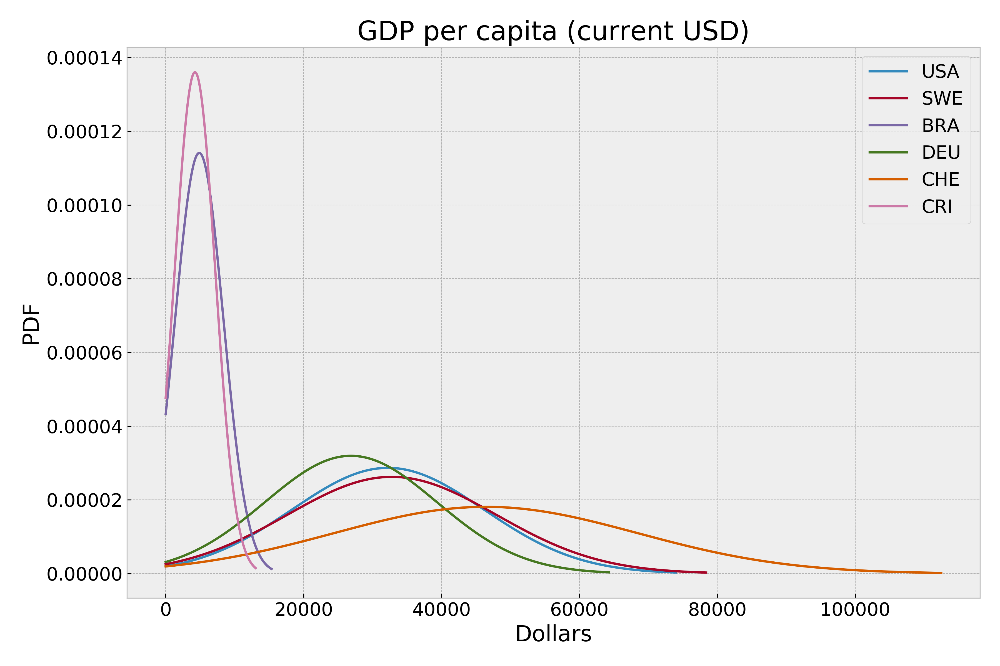

# Education Spending & Outcomes Comparison

## Introduction
I have a son who just finished up first grade. The last two months of his school year took place through a remote-learning platform, and the continuing COVID-19 pandemic could result in much if not all of his second grade education happening through the same platform. I've been thinking a lot about our education system since he's become school-aged, as well as my own education and the effectiveness and utility of the education system in the US. There are huge differences state-to-state within the US, which are illustrated when my wife and I talk about our own education experiences (New York and Nevada respectively) and the in-process education of our son.

Every nation has their own theory of how to educate its children and in turn, different outcomes within the population. Some of those outcomes are easily quantifiable and easily correlated to education funding. Many other outcomes are less concrete. With this dataset, I jumped in to explore some of these ideas.

## My Question

**How does the relationship between education spending correlate to different outcomes?**\
I used government expenditure on education as a percentage of GDP as the main feature of this study. 
I chose an **_α = 0.05_**, as there are likely many factors independent of education funding that could have an effect on the outcomes. 

## Data Cleanup
Data cleaning was performed using Pandas to remove the many NaN values in the dataset, reducing the dataset down from >326MB to 95MB. There were numerous indicator codes that had no records, and there were many years that had no data at all (including years for projections from 2020 - 2100).

## Indicators
From The World Bank:
> "World Development Indicators (WDI) is the primary World Bank collection of development indicators, compiled from officially recognized international sources. It presents the most current and accurate global development data available, and includes national, regional and global estimates."

I downloaded the data from The World Bank Open Data website, and it was well-organized and relatively junk-free.

There are many codes (~3600 per country) listed within the data, and many seem to overlap in spirit. Each of the descriptions is fairly clear, and after much digging, the following Indicator Codes were interesting to me:

* Government expenditure as % of GDP - SE.XPD.TOTL.GD.ZS  
* Expenditure on primary education as % of total on education - SE.XPD.PRIM.ZS 
* Pupil-teacher ratios in primary education - SE.PRM.ENRL.TC.ZS
* Number of teachers in primary education - SE.PRM.TCHR
* Percentage of the labor force with advanced education - SL.TLF.ADVN.ZS
* GRP per capita, current dollars - NY.GDP.PCAP.CD  

## Visualization
Below is a chart showing the selected countries and their respective spending on education as a % of GDP.

Distributions of the percentage of the labor force with advanced educations.

This chart shows the distributions of GDP per capita for our selection of countries

## Indicator Selection for Hypothesis Testing
To select the indicators I would use for hypothesis testing, I created a correlation matrix of all the chosen indicators within a country. Then I filtered those above a correlation value of |0.5| to see which codes would be most relevant for a T-test. This varied pretty widely from country-to-country.

